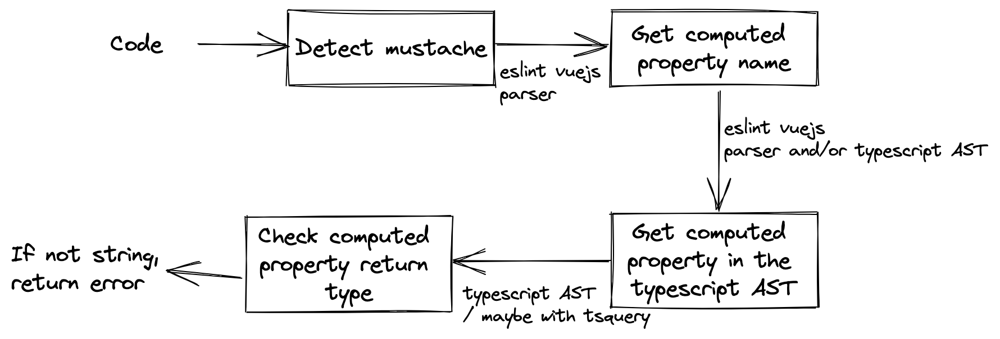

The target is to solve the objectives.

- Everything is in the file src/mwe.vue
- JSDoc type inference with Typescript is activated
- What's left is to add the eslint custom rules to capture the three flags

As help, a blueprint for objective 3 is the following:
